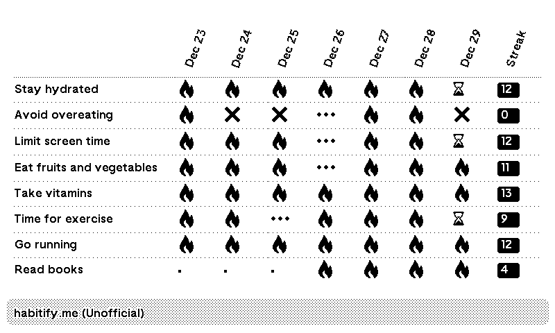

# TRMNL Habitify Plugin

Unofficial Habitify plugin for TRMNL.



## Details
Habitify is a multiplatform habit tracker app designed to help users build and maintain positive habits through 
personalized tracking and insightful progress metrics. It offers an API that provides access to habits and their 
statuses. This plugin retrieves that data, calculates the current streak, and sends it to TRMNL, displaying it 
on an e-ink screen.

## Requirements
This code interacts with both the Habitify REST API and the TRMNL webhook API. You will need to host and execute 
the code yourself to periodically push updated habit data from Habitify to TRMNL.

## Setup
1. In TRMNL, navigate to **Plugins -> Private Plugin -> Add New**. Assign a name and select "Webhook" as the strategy. Save the settings.
2. Copy the contents of ``template.html.liquid`` and paste it into the markup section of your TRMNL plugin.
3. Copy the Plugin UUID and your TRMNL API key.
4. Download the code and rename the ``.env_template`` file to ``.env``. Then, populate it as follows:
```
TRMNL_API_KEY=<your api key>
TRMNL_PLUGIN_ID=<your plugin UUID>
HABITIFY_API_KEY=<your habitify api key>
```

To obtain your Habitify API key and shared secret, go to the Habitify mobile app, open settings, then choose API Credentials.

5. Run ``bundle``

6. Run ``main.rb``. If it successfully posts data to TRMNL, you are all set. You can refresh the TRMNL interface to check if the data is visible.

To ensure the data remains current, schedule the script to run at regular intervals that suit your requirements, such as using cron jobs.

## Disclaimer

This plugin is an unofficial, non-commercial project and is not affiliated with, endorsed by, or supported by Habitify.

Please note that "Habitify" and related trademarks are the property of their respective owners. Using this plugin does not grant any rights to these trademarks, nor does it imply any association with or endorsement by the trademark owners.


### Links

- https://help.usetrmnl.com/en/articles/9510536-private-plugins
- https://usetrmnl.com/framework
- https://github.com/Shopify/liquid
- https://github.com/usetrmnl/plugins
- https://docs.usetrmnl.com/go/private-plugins/create-a-screen
- https://docs.habitify.me/
- https://www.habitify.me/
- https://github.com/eindpunt/awesome-TRMNL

### Check out my other private TRMNL plugins.
- https://github.com/sejtenik?tab=repositories&q=trmnl-